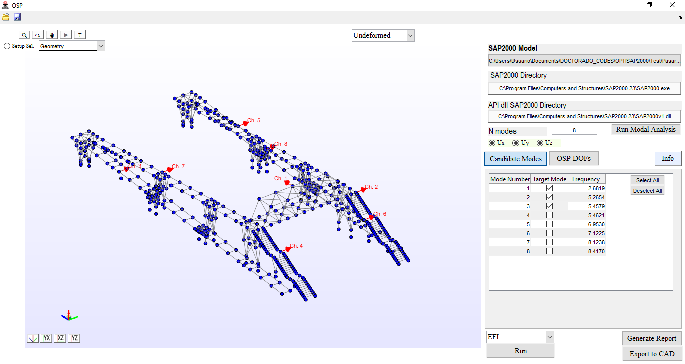

# OSP-SAP: Optimal Sensor Placement for SAP2000

**OSP-SAP** is a MATLAB-based Graphical User Interface (GUI) designed for **Optimal Sensor Placement (OSP)** in **SAP2000** finite element models. The software integrates four optimization algorithms to determine the best sensor locations for **Operational Modal Analysis (OMA)**, ensuring efficient structural monitoring.

## Features
- Intuitive **MATLAB AppDesigner** GUI.
- Direct integration with **SAP2000** FEM models.
- Implementation of four OSP algorithms:
  - **Effective Independence (EfI)**
  - **Mass Weighted Effective Independence (EfIwm)**
  - **Strain Energy Matrix Rank Optimization (SEMRO)**
  - **Kinetic Energy Matrix Rank Optimization (KEMRO)**
- Interactive visualization of results.
- Export sensor layouts as **AutoCAD (.dxf)** files and **Word (.docx)** reports.
- Open-source and customizable for further research.

## Installation
1. Ensure you have **MATLAB** installed.
2. Download the latest release from the [Releases](https://github.com/asanchezlc/OSP-SAP) section.
3. Install the MATLAB App:
   - Open MATLAB and navigate to the downloaded `OSP_SAP.mlappinstall` file.
   - Double-click the file or use the `matlab.apputil.install` command.
4. Open MATLAB and launch **OSP-SAP** from the App Manager.

## Usage
1. Load a **SAP2000** finite element model in `.xls` format.
2. Select target mode shapes and sensor constraints.
3. Choose one of the four OSP algorithms.
4. Run the optimization and analyze results via interactive visualizations.
5. Export the optimized sensor layout in **AutoCAD (.dxf)** and **Word (.docx)** formats.

## Citation [to be included!]
If you use **OSP-SAP** in your research, please cite:

<!-- @article{yourcitation, author = {Your Name and Co-Authors}, title = {OSP-SAP: A MATLAB module and software for Optimal Sensor Placement in SAP2000}, journal = {SoftwareX}, year = {2024}, doi = {your-doi} } -->

## License
This project is licensed under the **MIT License**. See the [LICENSE](LICENSE) file for details.

